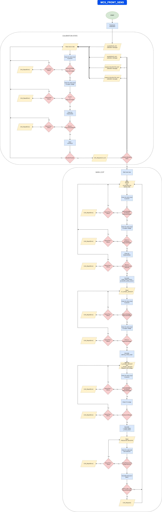

# MCS_front_sens

Addresses:

TxID: **0x005A**

RxID: **0x005F**

# Request

1. Calibrate:
   If it's the first request, _MCS_Main_ shall expect 1 as an response. For each next request, the _MCS_Front_Sens_ will respond with the value of pedal position calibrated the step before.

| RxID | 2   | 0x3D | 0x01  |
| ---- | --- | ---- | ----- |
|      | DLC | READ | RegID |

2. Stop calibration:

| RxID                                   | 3   |       | 0x02  | 0xNN      | Range | Units |
| -------------------------------------- | --- | ----- | ----- | --------- | ----- | ----- |
|                                        | DLC | WRITE | RegID | data[0-7] | 8bit  | 0-1   |
| Calibration status value:(1-0N, 0-OFF) |     |       |       |           |       |       |

3.  Brake pedal position, accelerator pedal position and steering wheel angle values:

| RxID | 2   | 0x3D | 0x03  |
| ---- | --- | ---- | ----- |
|      | DLC | READ | RegID |

4. Right and left wheel speed values:

| RxID | 2   | 0x3D | 0x04  |
| ---- | --- | ---- | ----- |
|      | DLC | READ | RegID |

5. Pressure values:

| RxID | 2   | 0x3D | 0x05  |
| ---- | --- | ---- | ----- |
|      | DLC | READ | RegID |

6. Handshake with _MCS_Main_:

| RxID                                   | 2   |     | 0xFF  |
| -------------------------------------- | --- | ----- | ----- |
|                                        | DLC | WRITE | RegID |

# Respond

1. Current value of a given sensor position:

| TxID | 3   | 0x01  | 0xNN      | 0xNN       | Range | Units   |
| ---- | --- | ----- | --------- | ---------- | ----- | ------- |
|      | DLC | RegID | data[0-7] | data[8-15] | 16bit | 0-65535 |

2. Brake pedal position, accelerator pedal position and steering wheel angle values:

| TxID | 7   | 0x03  | 0xNN                      | 0xNN                       | 0xNN                            | 0xNN                             | 0xNN                      | 0xNN                       | Range | Units   |
| ---- | --- | ----- | ------------------------- | -------------------------- | ------------------------------- | -------------------------------- | ------------------------- | -------------------------- | ----- | ------- |
|      | DLC | RegID | data[0-7]                 | data[8-15]                 | data[16-23]                     | data[24-31]                      | data[32-39]               | data[40-47]                | 16bit | 0-65535 |
|      |     |       | Brake pedal position[0-7] | Brake pedal position[8-15] | Accelerator pedal position[0-7] | Accelerator pedal position[8-15] | Steering wheel angle[0-7] | Steering wheel angle[8-15] |       |         |

3. Right and left wheels speed values:

| TxID | 5   | 0x04  | 0xNN                   | 0xNN                    | 0xNN                  | 0xNN                   | Range | Units   |
| ---- | --- | ----- | ---------------------- | ----------------------- | --------------------- | ---------------------- | ----- | ------- |
|      | DLC | RegID | data[0-7]              | data[8-15]              | data[16-23]           | data[24-31]            | 16bit | 0-65535 |
|      |     |       | Right wheel speed[0-7] | Right wheel speed[8-15] | Left wheel speed[0-7] | Left wheel speed[8-15] |       |         |

4. Pressure values:

| TxID | 5   | 0x05  | 0xNN                            | 0xNN                             | 0xNN                             | 0xNN                              | Range | Units   |
| ---- | --- | ----- | ------------------------------- | -------------------------------- | -------------------------------- | --------------------------------- | ----- | ------- |
|      | DLC | RegID | data[0-7]                       | data[8-15]                       | data[16-23]                      | data[24-31]                       | 16bit | 0-65535 |
|      |     |       | Pressure from first sensor[0-7] | Pressure from first sensor[8-15] | Pressure from second sensor[0-7] | Pressure from second sensor[8-15] |       |         |

# Error list

1. Brake sensor short circuit to ground

| TxID | 2   | 0x1D  | 0x01 |
| ---- | --- | ----- | ---- |
|      | DLC | ERROR | Code |

2. Brake sensor short circuit to VCC

| TxID | 2   | 0x1D  | 0x02 |
| ---- | --- | ----- | ---- |
|      | DLC | ERROR | Code |

3. Brake sensor implausibility - short circuit between the signal lines

| TxID | 2   | 0x1D  | 0x03 |
| ---- | --- | ----- | ---- |
|      | DLC | ERROR | Code |

4. Brake sensor implausibility - signal out of range

| TxID | 2   | 0x1D  | 0x04 |
| ---- | --- | ----- | ---- |
|      | DLC | ERROR | Code |

5. Brake sensor implausibility - deviation of more than ten percentage points pedal travel between two sensors

| TxID | 2   | 0x1D  | 0x05 |
| ---- | --- | ----- | ---- |
|      | DLC | ERROR | Code |

6. Accelerator sensor short circuit to ground

| TxID | 2   | 0x1D  | 0x06 |
| ---- | --- | ----- | ---- |
|      | DLC | ERROR | Code |

7. Accelerator sensor short circuit to VCC

| TxID | 2   | 0x1D  | 0x07 |
| ---- | --- | ----- | ---- |
|      | DLC | ERROR | Code |

8. Accelerator sensor implausibility - short circuit between the signal lines

| TxID | 2   | 0x1D  | 0x08 |
| ---- | --- | ----- | ---- |
|      | DLC | ERROR | Code |

9. Accelerator sensor implausibility - signal out of range

| TxID | 2   | 0x1D  | 0x09 |
| ---- | --- | ----- | ---- |
|      | DLC | ERROR | Code |

10. Accelerator sensor implausibility - deviation of more than ten percentage points pedal travel between two sensors

| TxID | 2   | 0x1D  | 0x0A |
| ---- | --- | ----- | ---- |
|      | DLC | ERROR | Code |

11. Steering wheel sensor short circuit to ground

| TxID | 2   | 0x1D  | 0x0B |
| ---- | --- | ----- | ---- |
|      | DLC | ERROR | Code |

12. Steering wheel sensor short circuit to VCC

| TxID | 2   | 0x1D  | 0x0C |
| ---- | --- | ----- | ---- |
|      | DLC | ERROR | Code |

13. Right wheel sensor short circuit to ground

| TxID | 2   | 0x1D  | 0x0D |
| ---- | --- | ----- | ---- |
|      | DLC | ERROR | Code |

14. Right wheel sensor implausibility - signal out of range

| TxID | 2   | 0x1D  | 0x0E |
| ---- | --- | ----- | ---- |
|      | DLC | ERROR | Code |

15. Left wheel sensor short circuit to ground

| TxID | 2   | 0x1D  | 0x0F |
| ---- | --- | ----- | ---- |
|      | DLC | ERROR | Code |

16. Left wheel sensor implausibility - signal out of range

| TxID | 2   | 0x1D  | 0x10 |
| ---- | --- | ----- | ---- |
|      | DLC | ERROR | Code |

17. Under pressure

| TxID | 2   | 0x1D  | 0x11 |
| ---- | --- | ----- | ---- |
|      | DLC | ERROR | Code |

18. Over pressure

| TxID | 2   | 0x1D  | 0x12 |
| ---- | --- | ----- | ---- |
|      | DLC | ERROR | Code |
